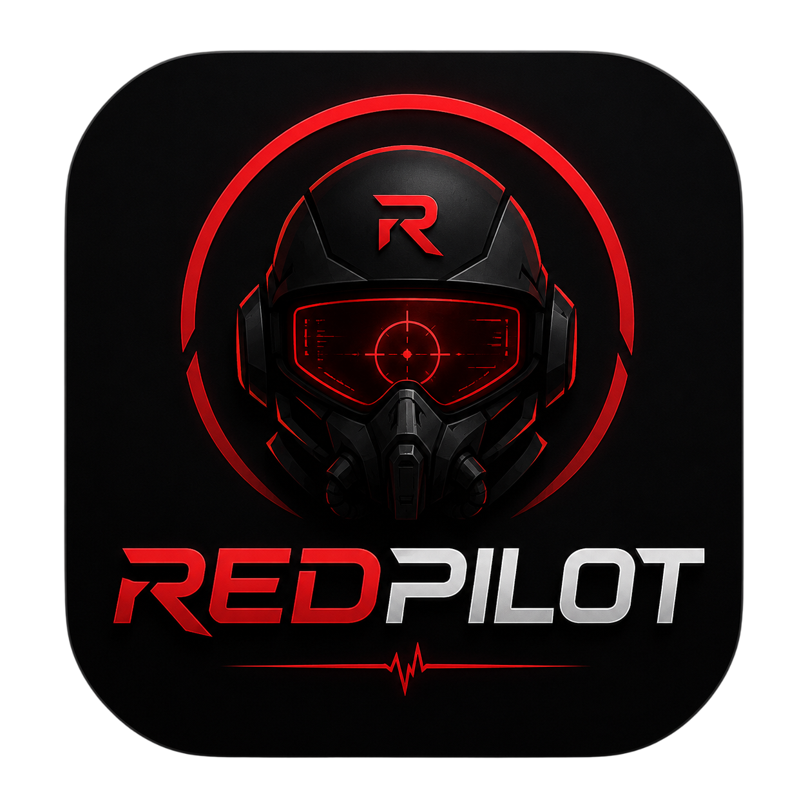

<div align="center">
  
  <h1>REDPILOT</h1>
  <p><strong>Autonomous Penetration Testing Framework</strong></p>
  <p>
    
    
    
    
    
  </p>
</div>

---

## 🔴 Overview

**REDPILOT** is an AI-powered autonomous penetration testing framework that orchestrates LLM-driven security agents to discover, analyze, and report on vulnerabilities in target systems.

Built with a **terminal-first philosophy**, REDPILOT provides a rich interactive TUI (Terminal User Interface) powered by [Ink](https://github.com/vadimdemedes/ink) (React for CLIs). The TUI serves as the operator's command center — configure providers, dispatch agents, monitor live penetration testing workflows, and review findings — all from the terminal.

### Key Features

- 🤖 **AI-Powered Agents** — LLM-driven security agents that autonomously execute penetration testing tasks
- 🎛️ **Multi-Provider Support** — Works with OpenRouter, Google Gemini, and OpenAI-compatible providers (OpenCode)
- 🔬 **Agent Orchestration** — Task manager dispatches and coordinates multiple security agents
- 🛠️ **Tool Execution Layer** — Sandboxed execution of security tools (subfinder, nmap, nuclei, etc.)
- 📋 **Live Streaming** — Real-time token streaming, agent status updates, and tool activity logs
- ✅ **Human-in-the-Loop** — Approval prompts for sensitive operations with inline resolution
- 📊 **Task Graph View** — Visual kanban-style view of task dependencies and execution status
- 📝 **Structured Audit Logging** — All actions logged with full traceability
- 🔌 **Provider-Agnostic Architecture** — Easy to add new LLM providers via a simple fetcher interface

---

## 🚀 Quick Start

### Option 1: One-Command Install

```bash
curl -fsSL https://raw.githubusercontent.com/redpilot/redpilot/main/install.sh | bash
```

After installation:

```bash
redplt
```

### Option 2: Manual Setup

```bash
# Clone the repository
git clone https://github.com/redpilot/redpilot.git
cd redpilot/apps/tui

# Install dependencies
npm install

# Start the TUI
redplt
```

> **Note:** The TUI connects to a mock backend by default for development. Start it alongside:

```bash
cd apps/tui && npx tsx mock-server/index.ts
```

---

## 🖥️ Usage

### First Launch — Setup Wizard

On first launch, REDPILOT guides you through configuration — select your LLM provider, enter your API key, and browse available models.

### Interactive Prompt

After setup, the console shows a clean prompt awaiting your task:

```
> _
```

### Commands

| Command | Description |
|---------|-------------|
| `/models` | Show the LLM model catalog for your provider |
| `/logout` | Return to the Setup Wizard |
| `/help` | Display available commands |

### Running a Penetration Test

Type a task at the `>` prompt to start agent execution:

```
> scan example.com
```

REDPILOT dispatches agents and shows live execution views:

- **Agent Tree** — Live status of all dispatched agents
- **Streaming Output** — Real-time LLM reasoning tokens
- **Tool Activity Log** — Every tool invocation and result
- **Task Graph** — Dependency graph of task execution
- **Approval Prompts** — Human-in-the-loop for sensitive operations

---

## 🏗️ Architecture

```
┌─────────────────────────────────────────────────────────────┐
│                        REDPILOT TUI                         │
│                                                             │
│  ┌──────────┐  ┌──────────────┐  ┌─────────────────────┐  │
│  │  Setup   │  │   Main       │  │   ExecutionScreen    │  │
│  │  Wizard  │→ │  Console     │→ │   (agents, tools)   │  │
│  └──────────┘  │  (idle >)    │  └──────────┬──────────┘  │
│                └──────────────┘             │               │
│                                   ┌─────────▼─────────┐    │
│                                   │   SessionClient    │    │
│                                   │   (WebSocket)      │    │
│                                   └─────────┬─────────┘    │
│                                             │               │
└─────────────────────────────────────────────┼───────────────┘
                                              │
┌─────────────────────────────────────────────▼───────────────┐
│                    Backend (FastAPI)                         │
│                                                             │
│  ┌──────────┐  ┌──────────┐  ┌──────────┐  ┌──────────┐  │
│  │  Task    │→ │  Agent   │→ │  Tool    │→ │  Audit   │  │
│  │  Manager │  │  Registry│  │  Executor│  │  Logger  │  │
│  └──────────┘  └──────────┘  └──────────┘  └──────────┘  │
│       │              │              │                      │
│       ▼              ▼              ▼                      │
│  ┌──────────┐  ┌──────────┐  ┌──────────┐                │
│  │  Graph   │  │  Agent   │  │  Sandbox │                │
│  │  Store   │  │  Logic   │  │  Runner  │                │
│  └──────────┘  └──────────┘  └──────────┘                │
│                                                             │
└─────────────────────────────────────────────────────────────┘
```

### Core Components

| Component | Description |
|-----------|-------------|
| **Setup Wizard** | Provider selection, API key entry, model catalog browsing |
| **Main Console** | Interactive prompt — idle until user submits a task |
| **Execution Screen** | Live agent dashboard (mounted only during task execution) |
| **SessionClient** | Typed WebSocket client for the REDPILOT event contract |
| **Agent Tree** | Live status dashboard for all spawned agents |
| **Streaming Output** | Real-time LLM token display with per-agent buffers |
| **Tool Activity Log** | Chronological log of tool invocations and results |
| **Task Graph View** | Kanban-style task dependency visualization |
| **Approval Prompt** | Inline modal for human-in-the-loop approval |
| **ModelCatalog** | Provider-agnostic model fetching, caching, and normalization |

### Supported LLM Providers

| Provider | Endpoint | Authentication |
|----------|----------|----------------|
| **OpenCode** | `https://opencode.ai/zen/v1/models` | Public |
| **OpenRouter** | `https://openrouter.ai/api/v1/models` | Bearer token |
| **Google Gemini** | `https://generativelanguage.googleapis.com/v1beta/models` | API key |

---

## 💻 Development

### Prerequisites

- **Node.js** 18+ (required for the TUI)
- **Python** 3.x (recommended for backend penetration testing tools)
- **npm** (included with Node.js)

### Project Structure

```
redpilot/
├── apps/
│   └── tui/                    # Terminal UI (Ink + React)
│       ├── src/
│       │   ├── index.tsx        # Entry point, screen routing
│       │   ├── screens/
│       │   │   ├── SetupWizard.tsx     # Provider configuration
│       │   │   ├── MainConsole.tsx      # Idle prompt (default screen)
│       │   │   └── ExecutionScreen.tsx  # Agent dashboard (task active)
│       │   ├── components/      # UI components
│       │   ├── services/        # ModelCatalog, config-store
│       │   ├── ws-client/       # Typed WebSocket client
│       │   ├── theming/         # Colors, ASCII art
│       │   └── debug/           # Debug logger, headless runner
│       ├── mock-server/         # Standalone WS + REST mock
│       └── scripts/             # Installer scripts
├── packages/                    # Backend packages (Python)
├── tests/                       # Integration tests
├── icon.png                     # Application icon
├── README.md                    # This file
└── pyproject.toml
```

### Development Workflow

```bash
# Terminal 1: Start the mock server
cd apps/tui && npx tsx mock-server/index.ts

# Terminal 2: Start the TUI
cd apps/tui && npm run dev

# Run tests
cd apps/tui && npm test
```

### Adding a New LLM Provider

1. Create a fetcher class implementing `ProviderFetcher` in `apps/tui/src/services/ModelCatalog.ts`
2. Register it: `ModelCatalog.register(new MyProviderFetcher())`
3. Add the provider to the `PROVIDERS` array in `SetupWizard.tsx`

---

## 📡 Event Contract

The TUI and backend communicate via a typed WebSocket contract defined in `SessionClient.ts`.

| Event Type | Direction | Description |
|---|---|---|
| `agent.spawned` | Server → TUI | A new agent has been created |
| `agent.status` | Server → TUI | Agent status update |
| `token.delta` | Server → TUI | Streaming LLM token output |
| `tool.invoked` | Server → TUI | A security tool has been invoked |
| `tool.result` | Server → TUI | Tool execution result with summary |
| `approval.requested` | Server → TUI | Human approval required |
| `approval.resolved` | TUI → Server | User's approval decision |
| `plan.updated` | Server → TUI | Task graph state snapshot |
| `report.ready` | Server → TUI | Penetration test report generated |

---

## 🛡️ Security Notice

REDPILOT is a **penetration testing framework** designed for authorized security assessments only.

- **Only use REDPILOT against systems you own or have explicit written permission to test.**
- Unauthorized use of penetration testing tools may violate computer fraud and abuse laws.
- The developers assume no liability for misuse of this software.
- API keys are stored in memory only — never persisted to disk by the TUI.

---

## 🗺️ Roadmap

- [ ] **Real-time report generation** — Structured markdown/HTML reports
- [ ] **Ollama/LM Studio support** — Local model hosting
- [ ] **Plugin system** — Extensible tool and agent plugins
- [ ] **Session persistence** — Resume interrupted engagements
- [ ] **Multi-target orchestration** — Parallel testing across targets
- [ ] **Web UI** — Browser-based alternative to the TUI
- [ ] **CI/CD integration** — Automated pipeline security testing

---

## 🤝 Contributing

Contributions are welcome! Please follow these guidelines:

1. Fork the repository
2. Create a feature branch: `git checkout -b feature/my-feature`
3. Commit your changes: `git commit -m 'Add some feature'`
4. Push to the branch: `git push origin feature/my-feature`
5. Open a pull request

### Coding Standards

- TypeScript strict mode with `noUncheckedIndexedAccess` enabled
- React functional components with hooks (no class components)
- Centralized color palette (no inline hex codes)
- Provider-agnostic architecture (no hardcoded model data)

---

## 📄 License

This project is licensed under the MIT License — see the [LICENSE](LICENSE) file for details.

---

<div align="center">
  <p>Built with 🔴 by the REDPILOT team</p>
  <p>
    <sub>For authorized security testing only. Use responsibly.</sub>
  </p>
</div>
